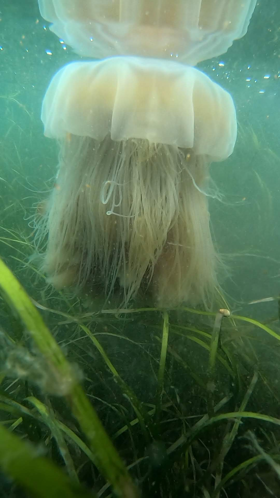

do do do do ... la la la la la

```{r setup, include=FALSE}
knitr::opts_chunk$set(echo = TRUE)
```

# Outline of the manuscript work

- Data Cleaning
- [Analysis](NCEAS_Ex1.1.html)
- Mapping
- Discussion

```{r graphics, fig.align = 'center', echo = FALSE, out.wdith = '55%'}
# This is including using knitr using R
knitr::include_graphics("https://seagrant.gso.uri.edu/wp-content/uploads/2018/08/Eelgrass_01.jpg")

```

This is included from my desktop using html



### Cheryl's Addition
texty shmexty